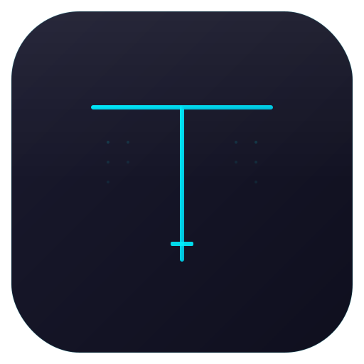

<p align="center">
  
</p>

<h1 align="center">Shellfire</h1>

<p align="center">
  <strong>The terminal multiplexer that replaces everything.</strong><br>
  AI-powered splits, IDE mode, 100+ plugins, pipelines, Docker, SSH, secrets vault — one app.
</p>

<p align="center">
  <a href="https://github.com/suvash-glitch/Shellfire/releases"></a>&nbsp;
  <a href="LICENSE"></a>&nbsp;
  &nbsp;
  
</p>

<br>

<p align="center">
  
</p>

<br>

> **v2 is here.** Rewritten session persistence, hardened plugin system, zero-flicker themes, scroll stability, atomic saves, and XSS-safe rendering throughout. [See what changed.](#whats-new-in-v2)

---

## Why Shellfire?

Your terminal workflow is scattered across 6 apps: a terminal emulator, tmux, an SSH client, a Docker dashboard, a secrets manager, and a notes app. Shellfire replaces all of them.

It's a **GPU-accelerated terminal multiplexer** built on Electron + xterm.js with:

- **Claude AI** built into every pane
- **100+ plugins** from the marketplace
- **Full CLI** for scriptable control
- **Cross-platform** — macOS, Windows, Linux

If tmux and VS Code had a baby that was raised by Claude, it would be Shellfire.

---

## Core Features

### Terminal Multiplexing

Split horizontally, vertically, or in any grid. Drag pane headers to reorder. Drag resize handles to adjust ratios. Zoom any pane to fullscreen with `Cmd+Shift+Enter`.

- Flexible row/column grid with per-pane flex ratios
- Drag-and-drop pane reordering
- Pane locking (prevent accidental close)
- Per-pane color coding (7 presets + custom hex)
- Copy-on-select with configurable clipboard behavior
- 10,000-line scrollback per pane (configurable up to 100K)

### AI Integration

Launch **Claude Code** directly inside any pane. AI error detection watches your terminal output and offers instant help when something breaks.

- One-click Claude Code launch from the toolbar
- Skip-permissions mode for autonomous AI operation
- Error detection hooks for plugin-powered AI assistants
- AI chat API supporting Anthropic, OpenAI, Google Gemini, and Ollama

### IDE Mode

Toggle `Cmd+Shift+I` for a VS Code-like experience. A sidebar groups terminals by project with process-aware icons, git branch display, and activity indicators. Editor-style tabs at the top. Click to switch, double-click to rename.

- Project-grouped terminal sidebar
- Process detection icons (Node, Python, Docker, SSH, Vim, Rust, Go, Ruby)
- Git branch + dirty status per terminal
- Activity indicator for background output
- Multi-pane IDE splits

### Zen Mode

`Cmd+Shift+Z` strips everything away — no titlebar, no tabs, no status bar. Just your terminal, fullscreen across all displays. Press Escape to return.

### Command Palette

`Cmd+P` opens a searchable palette with **70+ built-in commands** across 8 categories. Every feature in Shellfire is one keystroke away.

### tmux-Style Persistence

Close the Shellfire window. Your processes keep running. Reopen it later — Claude, vim, your shell, everything is exactly where you left it.

Shellfire v2 implements true process persistence the same way tmux does: PTY processes survive window close. On macOS, closing the window keeps the Electron app alive in the dock with all shells, editors, and long-running processes still running in the background. Clicking the dock icon reopens the window and reattaches to the live PTYs — same visual state, same conversation history, same everything.

- PTY processes persist across window close
- Output keeps accumulating in a 1MB rolling buffer per PTY
- Reopening reattaches to live processes, not replayed recordings
- Full alt-screen app support (Claude Code, vim, less, htop, etc.)
- Only `Cmd+Q` or reboot actually kills sessions
- Layout, colors, names, locks also saved to disk for cold starts

---

## Productivity Tools

### SSH Manager & Remote Discovery

Save SSH bookmarks with host, user, port, and encrypted password. One-click connect opens a new terminal with the SSH session. **Remote Discovery** connects to a host and finds running Shellfire/tmux/screen sessions, letting you open them all locally.

### Docker Dashboard

View all containers (running and stopped) with name, image, status, and ports. Click to exec into a running container or start a stopped one.

### Port Manager

See every listening port on your system. Identify the process, open `localhost:PORT` in your browser, or kill the process — all from the UI.

### Pipeline Runner

Build multi-step command pipelines in a visual editor. Add steps with commands and working directories, chain them sequentially, save/load pipelines, and export as `.sh` scripts. Import existing shell scripts to visualize them as pipelines.

### Secrets Vault

AES-256 encrypted environment variable storage. Add secrets, then inject them into any terminal with a single click. Secrets are device-encrypted and never leave your machine.

### Broadcast Mode

`Cmd+Shift+B` sends every keystroke to all panes simultaneously. Configure multiple servers, deploy to a fleet, or run the same debug commands everywhere at once.

### Linked Panes

Select specific panes to link together. Input to one linked pane broadcasts to all others in the group — more targeted than broadcast mode.

### Floating Panes

Pop any terminal out as a floating, draggable overlay. Picture-in-picture for terminals — watch logs while working in another pane.

### Keyword Watchers

Set up keyword alerts on any terminal. Get native OS notifications when "error", "FAIL", "deployed", or any pattern you define appears in the output.

### Command Bookmarks & Snippets

Save commands you use often. Organize by category and tags. One-click execution from the command palette or a dedicated panel.

### Scratchpad

Built-in notes panel for jotting down commands, URLs, debug notes, or anything else. Auto-saved as you type.

### Cron Manager

View, add, and remove system cron jobs from a visual UI. No more editing crontab by hand.

### File Finder

`Cmd+Shift+F` opens a fuzzy file finder across your working directories. Preview files inline, then open them in your editor.

### Startup Tasks

Define multi-pane startup configurations that auto-run when Shellfire launches. Set up your dev environment in one click: API server in pane 1, frontend in pane 2, database logs in pane 3.

---

## Plugin Ecosystem

Shellfire ships with a **marketplace of 100+ official plugins** spanning themes, commands, status bar widgets, and full extensions.

### Theme Plugins (30+)

Atom Dark, Ayu, Catppuccin Mocha, Cobalt2, Cyberpunk, Dracula Pro, Everforest, GitHub Dark/Light, Gruvbox, Horizon, Kanagawa, Moonlight, Night Owl, Nord Aurora, One Dark Pro, Palenight, Poimandres, Rose Pine, Shades of Purple, Solarized Light, Synthwave 84, Tokyo Night, Ubuntu, Vitesse Dark, and more.

### Command & Extension Plugins (70+)

| Plugin | Description |
|--------|-------------|
| **auto-rename** | Auto-renames panes based on foreground process |
| **broadcast-groups** | Save and restore broadcast groups |
| **cheatsheet** | Command cheatsheet viewer |
| **color-picker** | Eye dropper color tool |
| **diff-viewer** | Side-by-side diff viewer |
| **docker-dashboard** | Enhanced Docker management |
| **file-browser** | Navigate file system visually |
| **git-quick-commit** | Quick git commit from terminal |
| **git-status** | Git status in status bar |
| **http-client** | Make HTTP requests from the UI |
| **json-viewer** | Pretty-print JSON |
| **jwt-decoder** | Decode JWT tokens |
| **k8s-status** | Kubernetes context display |
| **log-highlighter** | Colorize log levels |
| **npm-scripts** | Show npm scripts in menu |
| **pomodoro-timer** | Productivity timer widget |
| **process-tree** | Visualize process tree |
| **regex-tester** | Interactive regex testing |
| **session-timer** | Track session duration |
| **split-layout-manager** | Save/restore custom layouts |
| **system-monitor** | CPU/memory monitoring |
| **terminal-recorder** | Record terminal sessions |
| **todo-scanner** | Scan for TODO comments |
| **tree-view** | File tree browser |
| **vim-keybindings** | Vim key bindings |
| **weather** | Weather widget |
| **workspace-switcher** | Switch between workspaces |

Install from the built-in marketplace (Settings > Extensions) or drop `.termext` packages into `~/.shellfire/plugins/`.

### Build Your Own Plugin

```javascript
// plugin.json
{
  "name": "my-plugin",
  "version": "1.0.0",
  "type": "command",
  "main": "index.js",
  "description": "My custom command"
}

// index.js
exports.name = "My Command";
exports.shortcut = "Cmd+Shift+M";
exports.execute = (ctx) => {
  ctx.sendInput(ctx.activePane.id, "echo Hello from my plugin!\n");
  ctx.notify("Command executed!");
};
```

**Plugin types:** `theme`, `command`, `extension`, `statusbar`

**Extension API** (`window._termExt`):
- `on(event, fn)` / `off(event, fn)` — hook into terminal events
- `registerCommand(cmd)` — add to command palette
- `addToolbarButton(opts)` — add UI button
- `addSidePanel(id, html)` — create side panel
- `addSettingsSection(html, onMount)` — extend settings
- `sendInput(id, data)` / `broadcast(ids, data)` — control terminals
- `showToast(msg)` — show notifications

---

## Installation

### Download

Grab the latest release for your platform from [**GitHub Releases**](https://github.com/suvash-glitch/Shellfire/releases):

| Platform | Format |
|----------|--------|
| macOS | `.dmg`, `.zip` |
| Windows | `.exe`, `.zip` |
| Linux | `.AppImage`, `.deb` |

### Build from Source

```bash
git clone https://github.com/suvash-glitch/Shellfire.git
cd Shellfire
npm install
npm run rebuild   # rebuild native modules (node-pty)
npm start         # launch in dev mode
```

**Prerequisites:** Node.js 18+, npm 9+, Python 3.x, Xcode CLI Tools (macOS) or C++ build tools (Windows/Linux).

**Build distributables:**

```bash
npm run build         # macOS (.dmg, .zip)
npm run build:win     # Windows (.exe, .zip)
npm run build:linux   # Linux (.AppImage, .deb)
```

---

## Quick Start

1. **Launch** — Shellfire opens with a single terminal pane
2. **Split** — `Cmd+D` right, `Cmd+Shift+D` down
3. **Navigate** — `Cmd+Arrow` between panes, `Cmd+1-9` to jump directly
4. **Command Palette** — `Cmd+P` to search and run any action
5. **Save** — `Cmd+Shift+S` saves your full workspace (auto-restores on launch)
6. **Customize** — `Cmd+,` opens settings, `Ctrl+Shift+T` cycles themes
7. **Plugins** — Settings > Extensions > browse the marketplace

---

## Keyboard Shortcuts

### Terminal

| Shortcut | Action |
|----------|--------|
| `Cmd+T` | New terminal |
| `Cmd+D` | Split right |
| `Cmd+Shift+D` | Split down |
| `Cmd+W` | Close pane |
| `Cmd+K` | Clear terminal |
| `Cmd+Shift+Enter` | Zoom / unzoom pane |
| `Cmd+1` – `Cmd+9` | Jump to pane by number |
| `Cmd+Arrow` | Navigate between panes |

### Search & Find

| Shortcut | Action |
|----------|--------|
| `Cmd+F` | Find in terminal |
| `Cmd+Shift+F` | File finder |
| `Ctrl+R` | Command history search |

### Tools

| Shortcut | Action |
|----------|--------|
| `Cmd+P` | Command palette |
| `Cmd+;` | Quick command bar |
| `Cmd+Shift+B` | Toggle broadcast mode |
| `Cmd+Shift+R` | Snippets runner |
| `Cmd+Shift+S` | Save session |
| `Cmd+Shift+L` | Toggle pane lock |
| `Cmd+Shift+P` | Port manager |

### View

| Shortcut | Action |
|----------|--------|
| `Cmd+Shift+I` | Toggle IDE mode |
| `Cmd+Shift+Z` | Toggle Zen mode |
| `Ctrl+Shift+T` | Cycle theme |
| `Cmd+=` / `Cmd+-` | Font size up / down |
| `Cmd+,` | Settings |

> On Windows and Linux, substitute `Ctrl` for `Cmd`.

---

## CLI

Control Shellfire from any shell. The CLI communicates over a Unix socket with the running app.

```bash
shellfire list                             # List all sessions
shellfire new -t backend -d ~/projects/api # Create named session in directory
shellfire attach -t backend                # Focus a session
shellfire send -t backend "npm start"      # Send input to a session
shellfire rename -t backend "API Server"   # Rename a session
shellfire kill -t backend                  # Close a session
shellfire remote user@host -p 22           # Discover remote sessions
```

### Zsh Completion

```bash
cp bin/_shellfire ~/.zsh/completions/_shellfire
exec zsh  # reload
```

---

## What's New in v2

### Stability

- **Zero-flicker theme system** — Themes now work entirely through CSS custom properties. No more inline style overrides that break when the DOM is rebuilt. Themes survive reloads, layout changes, and plugin loads without any visual glitch.

- **Clean session restore** — Previous versions replayed raw ANSI escape sequences into new PTY sessions, causing gibberish text. v2 strips escape codes and shows clean text history with clear `--- restored session ---` / `--- new session ---` separators. Fresh shell, clean context.

- **Scroll position stability** — Fixed the scroll-to-top bug where terminals would jump to the top during resize, layout changes, or pane reordering. Scroll state is now captured before every DOM operation and restored after fitting, with a layout-in-progress guard that prevents the ResizeObserver from interfering.

- **Atomic file writes** — All config, session, and data files now use write-to-temp + atomic rename. If Shellfire crashes mid-save, your data is never corrupted.

### Security

- **XSS-safe rendering** — All user-supplied content (pane names, process names, git branches) is now HTML-escaped before DOM insertion. Prevents injection through crafted terminal titles or branch names.

- **Sandbox-safe renderer** — Removed `process.env` references from the renderer process that would throw in Electron's sandboxed mode.

### Plugin System

- **Error isolation** — A broken plugin can no longer crash the app. Every plugin activation is wrapped in try-catch with graceful degradation.

- **Auto-disable broken widgets** — Statusbar plugins that throw 3 consecutive render errors are automatically disabled instead of silently failing forever.

- **Clean unload** — Plugin intervals, hooks, DOM elements, and registry entries are properly cleaned up on page unload, preventing memory leaks across reloads.

- **Visibility-aware rendering** — Plugin widgets skip rendering when the window is hidden, saving CPU and battery.

### Performance

- **Single theme application** — Init previously called `applyTheme()` 3 times during startup with race conditions between config, session restore, and plugin load. Now CSS properties are set once early, and a single final `applyTheme()` runs after all plugins are loaded.

- **Smarter resize debouncing** — ResizeObserver debounce increased from 50ms to 100ms and skips entirely during drag operations and active layout rebuilds.

---

## Architecture

```
shellfire/
├── main.js          # Main process: PTY lifecycle, IPC, file I/O, socket server
├── preload.js       # Context bridge: 100+ safe IPC methods
├── renderer.js      # Renderer: UI, xterm.js, plugins, state management
├── index.html       # Single-page app shell with 20+ modals/overlays
├── styles.css       # CSS custom properties theming, responsive layout
├── bin/
│   ├── shellfire-cli.js   # CLI tool (Unix socket IPC)
│   └── _shellfire         # Zsh completions
├── registry/
│   ├── plugins.json       # Marketplace metadata (100+ plugins)
│   └── plugins/           # Official plugin source code
├── examples/
│   └── plugins/           # Plugin starter templates
└── test/
    ├── main.test.js       # Main process tests
    ├── renderer.test.js   # Renderer tests
    ├── security.test.js   # Security & input validation
    ├── cli.test.js        # CLI tests
    ├── plugins.test.js    # Plugin system tests
    └── ipc.test.js        # IPC handler tests
```

**Key design decisions:**
- Strict **context isolation** — renderer has no Node.js access, all IPC goes through `preload.js`
- **CSP headers** enforced in both HTML meta tag and main process
- **Path sanitization** blocks directory traversal outside `$HOME` and `/tmp`
- **AES-256-CBC encryption** for the secrets vault (device-keyed)
- **GPU-accelerated rendering** via xterm.js WebGL addon with automatic canvas fallback

---

## Configuration

Settings are stored in your OS user data directory:

| File | Contents |
|------|----------|
| `config.json` | Theme, font size |
| `session.json` | Workspace layout, pane state, scroll history |
| `settings.json` | All preferences (AI, auto-save, shell, keybindings) |
| `snippets.json` | Saved command snippets |
| `profiles.json` | Layout profiles |
| `projects.json` | Quick-launch project definitions |
| `ssh-bookmarks.json` | SSH connection bookmarks |
| `secrets.json` | Encrypted environment variables |
| `pipelines.json` | Saved command pipelines |
| `cmd-bookmarks.json` | Command bookmarks |
| `startup-tasks.json` | Auto-run startup configurations |
| `notes.json` | Scratchpad notes |

**Locations:**

| Platform | Path |
|----------|------|
| macOS | `~/Library/Application Support/shellfire/` |
| Windows | `%APPDATA%/shellfire/` |
| Linux | `~/.config/shellfire/` |

Plugins are stored in `~/.shellfire/plugins/`.

---

## Development

```bash
npm start          # Launch in dev mode
npm test           # Run all tests (133 tests across 6 suites)
npm run lint       # ESLint check
npm run lint:fix   # Auto-fix lint issues
npm run rebuild    # Rebuild native modules after npm install
```

Run a single test file:
```bash
node --test test/main.test.js
```

### Code Style

- 2-space indentation, double quotes, always semicolons
- `const` by default, `let` when needed, never `var`
- camelCase for variables/functions, PascalCase for classes
- `// ====` section dividers in large files
- Commit prefixes: `Add`, `Fix`, `Update`, `Remove`, `Refactor`, `Docs`, `Test`

---

## Contributing

1. Fork the repo
2. Create a feature branch (`git checkout -b feature/amazing-thing`)
3. Make your changes
4. Run `npm test` to verify nothing breaks
5. Commit with a descriptive message (`Add amazing thing`)
6. Push and open a Pull Request

Plugin contributions are especially welcome — see the [plugin development guide](#build-your-own-plugin) above.

---

## License

[MIT](LICENSE) &copy; Suvash Bhusal
